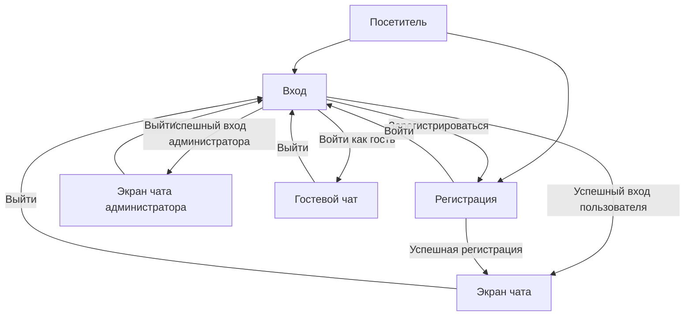

# Навигация и поведение пользователей (User Flows)

## 1. Типы пользователей

- **Посетитель** — не вошёл в аккаунт и ещё не выбрал вход в качестве гостя.
- **Гость** — открыл чат через вход в качестве гостя. Доступен один чат, который сохраняется при перезагрузке страницы.
- **Зарегистрированный пользователь** — вошёл в аккаунт или успешно зарегистрировался. Его чаты отображаются в сайдбаре.
- **Администратор** — вошёл в аккаунт администратора. Доступны функции обычного пользователя и панель администратора.

## 2. Правила доступа и навигации

- Посетитель может открыть только страницы входа и регистрации. При попытке открыть другую страницу он попадает на страницу входа.
- Гость и вошедший пользователь могут открывать чат.
- Вошедший пользователь не может открыть страницы входа и регистрации: при переходе на них он попадает на экран чата.
- У администратора в сайдбаре доступна кнопка «Панель администратора».
- Для всех вошедших пользователей, включая администраторов, доступна кнопка «Выйти». После выхода пользователь попадает на страницу входа.

## 3. Вход и регистрация

### Вход

1. Пользователь вводит логин и пароль.
2. При успешном входе обычный пользователь попадает на экран чата.
3. При успешном входе администратора он также попадает на экран чата; в сайдбаре ему доступна кнопка «Панель администратора».
4. Кнопка «Войти как гость» открывает гостевой чат.
5. Ссылка «Зарегистрироваться» открывает экран регистрации.
6. Иконка глаза переключает видимость пароля.

### Регистрация

1. Пользователь вводит отображаемое имя, логин и пароль.
2. При успешной регистрации создаётся аккаунт, и пользователь попадает на экран чата.
3. Ссылка «Войти» открывает экран входа.
4. Иконка глаза переключает видимость пароля.

### Схема переходов

## 4. Гостевой чат

- Гость попадает в чат после нажатия «Войти как гость».
- Гостю доступен один чат; он сохраняется при перезагрузке страницы.
- Гость может отправлять сообщения в этом чате.
- Кнопка «Выйти» возвращает гостя на страницу входа.

## 5. Чат зарегистрированного пользователя

- После входа или успешной регистрации пользователь попадает на экран чата.
- Чаты пользователя отображаются в сайдбаре.
- Кнопка «Новый чат» открывает новый пустой чат.
- Выбор чата в сайдбаре открывает этот чат.
- Кнопка «Выйти» возвращает пользователя на страницу входа.

## 6. Чат администратора и панель администратора

- После входа администратор попадает на экран чата.
- В сайдбаре администратора отображается кнопка «Панель администратора».
- Нажатие на кнопку открывает панель администратора.
- На страницах панели администратора сайдбар остаётся доступен: администратор может выбрать чат или открыть новый чат.
- Повторное нажатие «Панель администратора» открывает главную страницу панели. Если открыта карточка пользователя, это возвращает к главной странице панели.
- Кнопка «Выйти» возвращает администратора на страницу входа.

### Переходы в панели администратора

1. На главной странице панели администратор может искать пользователей по имени.
2. Администратор может выбрать период для показателей KPI: `1д`, `3д`, `7д` или `1м`.
3. Администратор может выбрать период для подсчёта сообщений. Доступны те же варианты: `1д`, `3д`, `7д` и `1м`.
4. Администратор может менять порядок сортировки столбцов таблиц по возрастанию или убыванию.
5. Элементы пагинации позволяют перейти на первую, предыдущую, следующую или последнюю страницу.
6. Нажатие на имя пользователя открывает карточку этого пользователя.
7. Кнопка «Назад» в карточке пользователя возвращает на главную страницу панели администратора.

## 7. Чаты в сайдбаре

- Кнопка сворачивания или разворачивания сайдбара меняет его состояние.
- Кнопка «Новый чат» открывает новый пустой чат.
- Выбор чата открывает его.
- Нажатие на иконку удаления рядом с чатом открывает диалог подтверждения.
- Подтверждение удаления удаляет чат из сайдбара.
